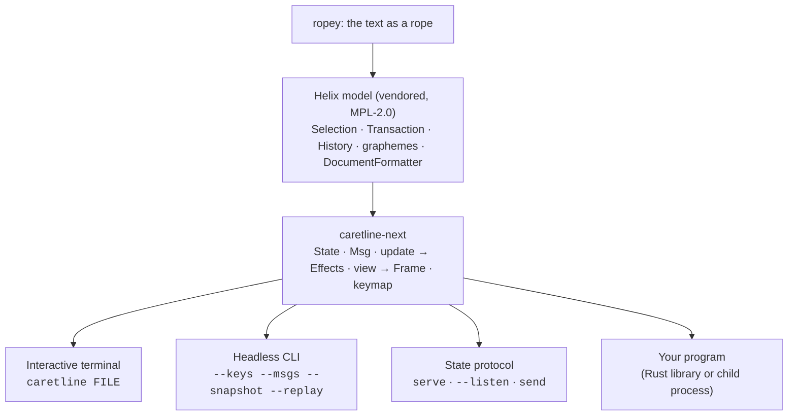

# caretline

caretline is a text-editing engine and a terminal text editor. The engine,
[`caretline-next`](../../crates/caretline-next), puts Helix's editing model (a rope,
multi-range selections, transactions, an undo tree, grapheme-correct motion and soft wrap)
inside a strict Elm architecture. The whole editor is one serializable `State`. Every input
is a `Msg`. A pure `update` function applies a message and returns `Effect`s for the
outside world, and a pure `view` function turns the state into a grid of cells. The engine
does no I/O and has no terminal code, so you can drive it from a terminal, a test, a script
or another program, and replay any session exactly. The `caretline` binary
([`caretline-app`](../../crates/caretline-app)) is the interactive editor and a headless
tool built on top.

```console
$ caretline notes.md                                   # edit a file
$ caretline --new-state notes.md --size 40x6 > s.json  # capture a state
$ caretline --state s.json --keys '<d-down>Done.' --snapshot 40x6
```

## What it covers

| Area | Status | Notes |
|---|---|---|
| Grapheme-correct editing | Yes | Carets never land inside an emoji, a ZWJ sequence, a flag or a combining accent |
| Wide characters | Yes | CJK and emoji take two cells, using Helix's width table (`unicode-width` 0.1.12) |
| Selections | Yes | Anchor and head per range, macOS text-field collapse rules |
| Multi-range selections | Engine only | `update` edits every range. No key creates extra ranges yet, but a state or a `Msg` sequence can |
| Transactions with position mapping | Yes | Every edit is a Helix `Transaction`; selections map through its changes |
| Undo and redo | Yes | Helix's revision tree. A typing run within 1.5 s is one step (up to 256 characters, breaking at a word past 128). Undo restores text and selection |
| Soft wrap | Yes | Visual-line motion with a goal column, page up and down, `Home`/`End` per visual row |
| No-wrap mode | Yes | `config.soft_wrap = false` scrolls sideways |
| Clipboard | Yes, as effects | `copy`/`cut` return `clipboard_set`; the runtime talks to the system clipboard |
| Saving | Yes, as effects | `save` returns `write_file`; the runtime writes and answers `saved` or `save_failed` |
| Mouse | Yes | Click, shift-click, drag and wheel, as `click` and `scroll` messages |
| Serializable state | Yes | `State` round-trips through JSON, history and goal column included |
| Deterministic replay | Yes | A trace (state + messages) replays to the identical state and frame |
| Headless snapshots | Yes | `--snapshot WxH` as plain text or ANSI |
| State protocol (`serve`, `--listen`, `send`) | Yes | Drive a headless engine or a live editor over JSON lines. See [protocol.md](protocol.md) |
| Syntax highlighting, search, multiple buffers | Not yet | |
| Keys that add cursors | Not yet | |
| Markdown structure (lists, tasks, folds) | Not yet | The older `caretline` crate has these; see below |

## The layers



The engine owns the editing rules. A runtime owns everything else: the clock, the terminal,
files and the clipboard.

## caretline and caretline-next

This repository has two editor engines. They are not the same thing.

| Crate | What it is | Used by |
|---|---|---|
| [`caretline-next`](../../crates/caretline-next) | The new engine: plain text on Helix's model, in the Elm architecture. **This documentation is about it.** | `caretline-app` |
| [`caretline-app`](../../crates/caretline-app) | The `caretline` binary: the interactive editor and the headless tools | |
| [`caretline`](../../crates/caretline) | The older engine: a block editor for Markdown (paragraphs, list items, tasks, folds, several views on one document) | thought-central's TUI (`thc-tui`) |

caretline-next is meant to replace the older engine once the TUI adopts it. That hasn't
happened yet. Today the TUI still runs on the older `caretline` crate. caretline-next doesn't
yet have that crate's block model or its multiple views per document. The binary named
`caretline` comes from `caretline-app`, which uses caretline-next, not from the crate named
`caretline`.

## Where to go next

| You want to | Read |
|---|---|
| Understand how it works | [architecture.md](architecture.md) |
| Call it from Rust | [api.md](api.md) |
| Look up a message, an effect or a key | [messages.md](messages.md) |
| Use the `caretline` command | [cli.md](cli.md) |
| Drive it over JSON lines | [protocol.md](protocol.md) |
| Put it inside your own app | [embedding.md](embedding.md) |
| Write or debug a test | [testing.md](testing.md) |

## License

`caretline-next` is MIT, except `src/helix/`, which is vendored from
[Helix](https://github.com/helix-editor/helix) and stays under the Mozilla Public License 2.0
file by file. `caretline-app` is MIT. See [embedding.md](embedding.md#licensing) for what
that means for you.
