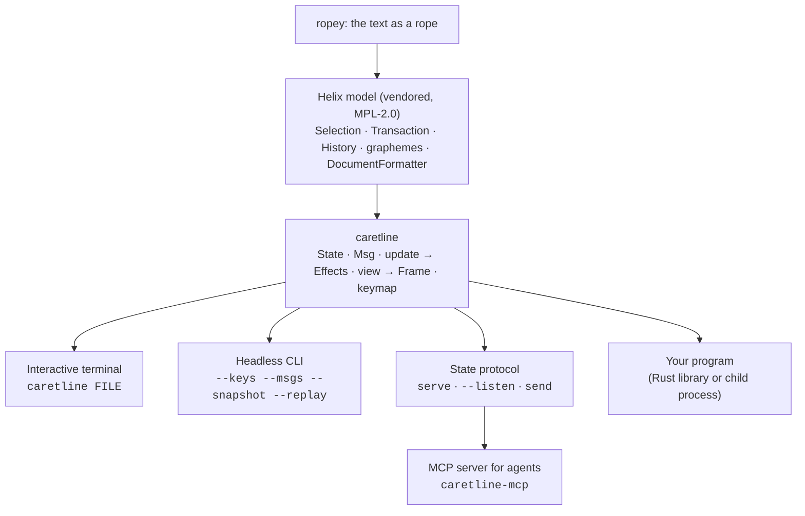

# caretline

caretline is a text-editing engine and a terminal text editor. The engine (the
[`caretline`](https://crates.io/crates/caretline) crate) puts Helix's editing model (a rope,
multi-range selections, transactions, an undo tree, grapheme-correct motion and soft wrap)
inside a strict Elm architecture. The whole editor is one serializable `State`. Every input
is a `Msg`. A pure `update` function applies a message and returns `Effect`s for the
outside world, and a pure `view` function turns the state into a grid of cells. The engine
does no I/O and has no terminal code, so you can drive it from a terminal, a test, a script
or another program, and replay any session exactly. The `caretline` binary
([`caretline-cli`](../../crates/caretline-app)) is the interactive editor and a headless
tool built on top.

```console
$ caretline draft.md                                   # edit a file
$ caretline --new-state draft.md --size 40x6 > s.json  # capture a state
$ caretline --state s.json --keys '<d-down>The end.' --snapshot 40x6
```

## Try it in one line

```sh
curl -fsSL https://caretline.app/install.sh | sh && caretline demo
```

A prebuilt binary for macOS or Linux, checked against its sha256 and installed to
`~/.local/bin`, then a guided tour that teaches by doing. Two more demos:
`caretline demo scenes` (ASCII animations running inside the editor) and `caretline demo agent`
(a scripted agent co-editing beside you over the editor's socket). With Rust instead:
`cargo install caretline-cli`.
See the [Quickstart](quickstart.md).

## What caretline is, and isn't

**caretline is a text-editing engine.** It edits text, moves carets and keeps history; it
reads text as blocks and draws the editing surface. It doesn't know what your text *means*.

| caretline is | caretline isn't |
|---|---|
| Text manipulation and navigation: graphemes, words, rows, pages | A notes app, a task manager or an outliner with opinions about what a line means |
| Carets, several ranges, selections | A store for anything but text, selections and marks |
| Undo and redo: Helix's tree, typing runs, history transformed over changes from elsewhere | A syntax highlighter or a language client |
| Generic structure: [marks](structure.md#marks-identity) with payloads, blocks, depth, folds, block operations | Statuses, completion, due dates, priorities or checkboxes |
| Views: several per document, read-only, follow modes | A persistence layer: it returns `write_file`, it never writes |
| Changes from elsewhere (`external`) | A sync engine |
| Rendering the editing surface: cells, roles, rows, hit-testing | Colours, themes or glyphs for your concepts |
| State, messages, replay and the [JSON protocol](protocol.md) | |

### What belongs in your app

Whatever your text *means*. If a line is a task, a ticket, a citation or a person, your app
decides that, keeps any data it needs beside the text, and adds behaviour through four
extension points ([embedding.md](embedding.md#extending-the-engine)):

| Extension point | What it is | Example |
|---|---|---|
| **Host commands** | Pure functions from (document, view, args) to an edit, run by `Msg::Command`, recorded in traces | "Cycle this line's tag" on a key your app binds |
| **Input rules** | Take an editing message before the engine does | Typing `[ ] ` at a line's start makes a list item |
| **Mark payloads** | Any JSON value on a block's mark, carried through edits, cut and paste, undo | A database row id per block |
| **Decorations** | Text and a role name drawn in a block's hang or gutter; hit-testing reports which | A badge drawn beside each item |

Every extension is a pure function registered under a name on the document's `Host`, so state,
traces and the protocol still work: replay registers the same functions. The default keymap
binds only generic commands ([keys.md](keys.md)); your app binds its own keys to its own
commands.

## What it covers

| Area | Status | Notes |
|---|---|---|
| Grapheme-correct editing | Yes | Carets never land inside an emoji, a ZWJ sequence, a flag or a combining accent |
| Wide characters | Yes | CJK and emoji take two cells, using Helix's width table (`unicode-width` 0.1.12) |
| Selections | Yes | Anchor and head per range, macOS text-field collapse rules |
| Multi-range selections | Engine only | `update` edits every range. No key creates extra ranges yet, but a state or a `Msg` sequence can |
| Transactions with position mapping | Yes | Every edit is a Helix `Transaction`; selections map through its changes |
| Undo and redo | Yes | Helix's revision tree. A typing run within 1.5 s is one step (up to 256 characters, breaking at a word past 128). Undo restores text and selection |
| Soft wrap | Yes | Visual-line motion with a goal column, page up and down, `Home`/`End` per visual row |
| No-wrap mode | Yes | `config.soft_wrap = false` scrolls sideways |
| Clipboard | Yes, as effects | `copy`/`cut` return `clipboard_set`; the runtime talks to the system clipboard |
| Saving | Yes, as effects | `save` returns `write_file`; the runtime writes and answers `saved` or `save_failed` |
| Mouse | Yes | Click, shift-click, drag and wheel, as `click` and `scroll` messages |
| Serializable state | Yes | `State` round-trips through JSON, history and goal column included |
| Deterministic replay | Yes | A trace (state + messages) replays to the identical state and frame |
| Headless snapshots | Yes | `--snapshot WxH` as plain text or ANSI |
| State protocol (`serve`, `--listen`, `send`) | Yes | Drive a headless engine or a live editor over JSON lines. See [protocol.md](protocol.md) |
| MCP server for agents | Yes | `caretline-mcp`: an agent edits a live editor alongside a person, with guarded writes, attribution and replay. See [mcp.md](mcp.md) |
| Syntax highlighting, search, multiple buffers | Not yet | |
| Keys that add cursors | Not yet | |
| Block structure | Yes | Block identity that survives edits, depth, folds, block operations, decorations. See [structure.md](structure.md) |
| Markdown lists, headings, fences | Yes | Markdown list editing, paste and files over the block structure. See [markdown.md](markdown.md) |
| Host extensions | Yes | Commands, input rules, mark payloads and decorations a host registers. See [embedding.md](embedding.md#extending-the-engine) |
| Command catalog | Yes | Every editing command with a stable id, and the default keymap as data. See [keys.md](keys.md) |

## The layers



The engine owns the editing rules. A runtime owns everything else: the clock, the terminal,
files and the clipboard.

## The crates

caretline is published on crates.io as [`caretline`](https://crates.io/crates/caretline)
(`cargo add caretline`, imported as `caretline::`).

| Crate in this repo | What it is | Used by |
|---|---|---|
| [`caretline`](../../crates/caretline) | caretline: plain text on Helix's model, in the Elm architecture. **This documentation is about it.** | `caretline-cli`, `thc-tui` |
| [`caretline-cli`](../../crates/caretline-app) | The `caretline` binary: the interactive editor and the headless tools | |
| [`caretline-mcp`](../../crates/caretline-mcp) | The `caretline-mcp` binary: an [MCP server](mcp.md) for agents | |

thc's TUI is one host: it opens each of its documents as one caretline document of blocks,
keys its own per-block data by mark, sends changes from its own store as `external` changes, and
builds its own concepts on top with host commands and decorations ([a case study](embedding.md#case-study-tasks-in-thc)).

## Where to go next

| You want to | Read |
|---|---|
| Understand how it works | [architecture.md](architecture.md) |
| Call it from Rust | [api.md](api.md) |
| Look up a message, an effect or a key | [messages.md](messages.md), [keys.md](keys.md) |
| Work with blocks, marks, folds and decorations | [structure.md](structure.md) |
| Edit Markdown lists and files | [markdown.md](markdown.md) |
| Add your own commands, data and drawing | [embedding.md](embedding.md#extending-the-engine) |
| Use the `caretline` command | [cli.md](cli.md) |
| Drive it over JSON lines | [protocol.md](protocol.md) |
| Let an agent edit alongside you (MCP) | [mcp.md](mcp.md) |
| Put it inside your own app | [embedding.md](embedding.md) |
| Write or debug a test | [testing.md](testing.md) |
| Know how fast it is, and its limits | [performance.md](performance.md) |

## License

caretline is MIT, except `src/helix/`, which is vendored from
[Helix](https://github.com/helix-editor/helix) and stays under the Mozilla Public License 2.0
file by file. `caretline-cli` is MIT. See [embedding.md](embedding.md#licensing) for what
that means for you.
