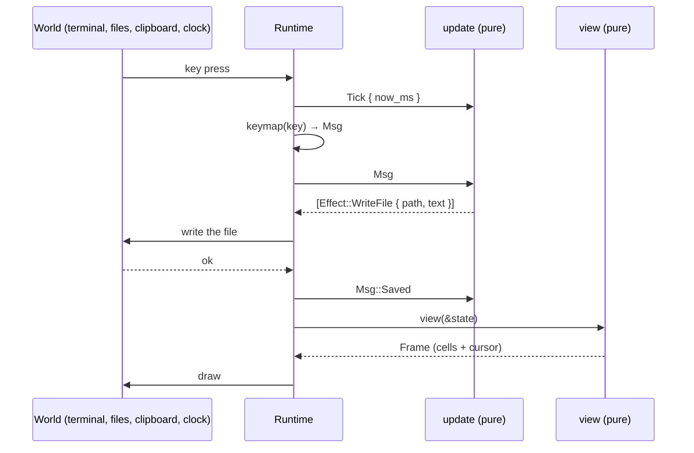
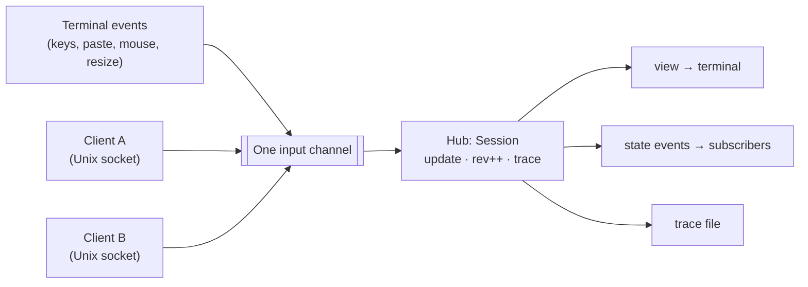

# Architecture

caretline-next is an Elm architecture around Helix's editing core. This page explains the
pieces, why they're pure, and how that makes every session reproducible.

## The pieces

| Piece | Type | What it is |
|---|---|---|
| State | `State` | Everything that decides the screen and the behaviour. Plain data that serializes to JSON |
| Message | `Msg` | Every input: an edit, a motion, a click, a resize, the clock, a save's result |
| Update | `update(&mut State, Msg) -> Vec<Effect>` | The only place state changes. Pure |
| Effect | `Effect` | Work for the outside world: write a file, set the clipboard, quit |
| View | `view(&State) -> Frame` | A grid of cells plus the caret's cell. Pure |
| Keymap | `keymap(&Key) -> Option<Msg>` | A key to a message. Pure, and separate from `update` |

```rust
use caretline_next::{keymap, update, view, Key, KeyCode, State, Viewport};

let mut state = State::new("hi", None, Viewport { width: 20, height: 3 });
let msg = keymap(&Key::plain(KeyCode::End)).unwrap();     // Move { forward, line_end }
let effects = update(&mut state, msg);                     // no effects for a motion
assert!(effects.is_empty());
assert_eq!(view(&state).cursor, Some((2, 0)));            // the caret is after "hi"
```

### What `State` holds

| Field | Meaning |
|---|---|
| `text` | The document, a `ropey::Rope` (a string in JSON) |
| `selection` | Helix `Selection`: one or more ranges, each an `anchor` and a `head` (the caret). `old_visual_position` holds the goal column |
| `scroll` | The top of the view: a document `line`, a visual `row` inside it, and a `col` offset when wrapping is off |
| `viewport` | `width` × `height` in cells. The last row is the status bar, unless `config.status_bar` is off |
| `clipboard` | The internal register: the last copy or cut |
| `path` | Where `save` writes, if anywhere |
| `history` | Helix's undo tree |
| `saved_revision`, `saving`, `dirty` | Which history revision is on disk, a save in flight, and whether they differ |
| `config` | `tab_width`, `soft_wrap`, `scrolloff`, `line_ending`, `status_bar` |
| `status` | A one-line message for the status bar, cleared by the next input |
| `now_ms` | The clock, as the last `tick` reported it |
| `run` | The open edit run (for undo grouping) |
| `quit_armed` | A first quit with unsaved changes arms it; the second quits |

Only `text` matters when a state is parsed: every other field is optional and gets what
`State::new` would give (see [Rehydration](#rehydration)).

`State` also carries a layout memo that is not part of its value: where the rows of long
soft-wrapped lines start (see [Long lines](#long-lines)). It is never serialized and never
affects equality.

## The update loop

A runtime turns the world into messages, feeds them to `update`, performs the effects and
feeds any results back as messages. Then it draws `view`.



The interactive `caretline` binary is exactly this loop
([`runtime.rs`](../../crates/caretline-app/src/runtime.rs)). Before each batch of messages
from a terminal event, it sends a `Tick` with the wall clock.

## Why purity

`update` reads no clock, uses no randomness and does no I/O. Three things follow.

- **Time is an input.** The runtime reports the time in `Msg::Tick { now_ms }`. `update`
  stores it in `state.now_ms`, and undo grouping compares those timestamps. Helix's
  `History` normally reads `Instant::now()`; the vendored copy takes caller-supplied
  milliseconds instead.
- **I/O is an output.** `save` doesn't write a file; it returns
  `Effect::WriteFile { path, text }`. A test can assert on that value. A headless run can
  print it. A runtime writes the file and answers `Msg::Saved` or `Msg::SaveFailed`.
- **The same inputs give the same state.** So a recorded session is just the initial state
  plus its messages.

### Undo grouping, worked through

Typing, `Backspace` and `Delete` each open a *run*. The next edit of the same kind amends the
same history revision if:

- it comes less than 1500 ms (`RUN_GAP_MS`) after the run's last edit, by `now_ms`,
- nothing else (a motion, a click, an undo) happened in between,
- it didn't replace a selection, and
- the run is not full (below).

`tick`, `resize`, `saved` and `save_failed` are *passive*: they never end a run.

A run is **full**, and the next edit starts a new undo step, once it has inserted or deleted
256 characters (`RUN_MAX_CHARS`). A typing run also breaks earlier at a word: once it holds
128 characters (`RUN_WORD_BREAK_CHARS`), text that starts with whitespace begins a new step.
So text streamed one character per message (an agent typing, or a fast typist who never
pauses) undoes a phrase of 128 to 256 characters at a time, each step starting at the space
before a word, instead of all at once. The cap also keeps every edit's cost bounded: amending
a revision recomposes its changes, which costs time linear in the run's length.

```rust
use caretline_next::{update, Msg, State, Viewport};

let mut s = State::new("", None, Viewport { width: 40, height: 3 });
for (now, text) in [(0, "one"), (500, " two"), (3000, " three")] {
    update(&mut s, Msg::Tick { now_ms: now });
    update(&mut s, Msg::InsertText { text: text.into() });
}
update(&mut s, Msg::Undo);
assert_eq!(s.text.to_string(), "one two"); // " three" came 2.5 s later: its own step
update(&mut s, Msg::Undo);
assert_eq!(s.text.to_string(), "");        // "one" and " two" were one run
```

## Revisions and determinism

There are two kinds of revision.

| Revision | Where | Counts |
|---|---|---|
| History revision | `state.history.current_revision()` | Undo steps. A typing run amends one revision; undo moves back along the tree. `saved_revision` and `dirty` are defined against it |
| Session rev | `Session::rev()` | Every message applied and every state replacement, +1 each. Clients of the [protocol](protocol.md) use it to detect changes they missed |

**Dirty** is `saved_revision != history.current_revision()`. Undoing back to the saved
revision makes the document clean again.

### Traces make sessions reproducible

A trace is JSON Lines. The first line is `{"state": …}`, and every later line is
`{"msg": …}`. The interactive runtime records every message it applies, including the
clock ticks and the save results its effects produced. So
`caretline_next::trace::replay_trace` reproduces the session exactly:

```text
{"state": {"text": "Selections have an anchor …", "selection": …, "history": …}}
{"msg": {"msg": "tick", "now_ms": 1000}}
{"msg": {"msg": "move", "dir": "forward", "by": "word"}}
{"msg": {"msg": "move", "dir": "forward", "by": "word", "extend": true}}
{"msg": {"msg": "tick", "now_ms": 1400}}
{"msg": {"msg": "insert_text", "text": "h"}}
```

A later `state` line (a session restarted into the same file, a `state.set`, or a
checkpoint) resets the state, and the replay continues from there.

`Session` keeps its trace in memory as **segments**: each starts with a `state` line (the
initial state, a `state.set`, or a `trace.checkpoint`) and holds the messages since, so each
segment replays on its own. A long-lived session keeps at most `DEFAULT_TRACE_LIMIT` (100,000)
lines, `Session::set_trace_limit` or `--trace-limit` to change it: past the limit it drops
the segments before the current one, and a segment that alone outgrows the limit is cut by an
automatic checkpoint. A `--trace` file is separate and keeps everything. See
[protocol.md](protocol.md#traces).

### Rehydration

`State::from_json` parses a state, then calls `sanitize`, which repairs anything a
hand-edited file could get wrong:

- Selection positions are clamped to the text and moved back to a grapheme boundary.
- An empty selection becomes a caret at 0.
- A zero viewport becomes 1 × 1, and a zero tab width becomes 1.
- A scroll line past the end resets to the top.
- A history whose current revision doesn't exist resets to empty.
- `dirty` is recomputed.

Parsing also fills in what's missing. Every field but `text` is optional (and `text` defaults
to empty): `selection` is a caret at 0, `viewport` 80 × 24, `scroll` the top, `history` fresh,
`run`, `status`, `saving` and `path` none, `now_ms` 0, and `config` the defaults, with the
line ending detected from the text. A missing `saved_revision` means saved at the current
history revision, so a pushed state starts clean; `"saved_revision": null` means never saved.
Inside `selection`, `old_visual_position` and `primary_index` are optional too. This is the
minimal state a client can push:

```json
{"text": "hello\nworld\n", "selection": {"ranges": [{"anchor": 0, "head": 5}]},
 "viewport": {"width": 40, "height": 10}, "config": {"soft_wrap": false}}
```

On any state `update` produced, `sanitize` changes nothing. So `to_json` followed by
`from_json` gives back an equal state, with the same frame and the same future behaviour.
The goal column and an open typing run survive the trip too.

## The runtime merges inputs into one queue

With the [state protocol](protocol.md), a live editor has two sources of input: the
terminal and protocol clients on a Unix socket. The runtime puts them on **one channel**, so
`update` sees a single order of messages, and that order is what the trace records.



The editor drains everything already queued, then redraws once, only if the rev changed.
The runtime also stamps time: before a client's messages it applies a `tick` with the real
time (outside `update`, as for keys), so the trace still replays exactly.

## Helix inside State

The vendored Helix files live in
[`crates/caretline-next/src/helix`](../../crates/caretline-next/src/helix). Here is how they
map into caretline.

| Helix | In caretline | How it's used |
|---|---|---|
| `Rope` (ropey) | `State.text` | The document. Serialized as a plain string |
| `Selection`, `Range` | `State.selection` | Anchor and head per range, a primary index, and `old_visual_position` for the goal column. Derives serde |
| `Transaction`, `ChangeSet` | Built inside `update` | Each edit builds one change per range, applies it to the rope, and sets the new selection |
| `Selection::map` | Undo and redo | When a history transaction has no selection, the current one is mapped through its changes |
| `History` | `State.history` | The revision tree. `commit_revision_at_timestamp` takes caller time; `amend_current_revision` (a caretline addition) folds a typing run into one revision |
| `graphemes` | Motion and deletes | `next_grapheme_boundary` and `prev_grapheme_boundary` keep every position on a boundary |
| `DocumentFormatter`, `TextFormat` | `layout.rs` and `view.rs` | Soft wrap, tab stops and visual positions. Wrapping needs more than 10 columns. `resume_at_row` (a caretline addition) starts it inside a long line |
| `LineEnding` | `Config.line_ending` | Detected from the text on load. Enter inserts it and pasted text is normalized to it |

What changed from upstream Helix is listed in
[`src/helix/README.md`](../../crates/caretline-next/src/helix/README.md): module paths, no
tree-sitter or regex, caller-supplied timestamps, serde derives, and resuming the formatter
at a row.

### Long lines

Helix's formatter lays a line out from its start, so finding the caret's row on a long
soft-wrapped line costs time linear in the line's length, and typing a long paragraph one
character at a time would cost quadratic time overall. For lines of 256 characters or more
(`LONG_LINE_CHARS`), layout remembers where each visual row starts (`WrapCache`, a memo in the
state) and restarts the formatter at the nearest known row with
`DocumentFormatter::resume_at_row`. An edit keeps the row starts before it, less two rows of
margin (a row's start depends only on the text before it and the next row), so typing at the
end of a long line re-lays about three rows. The memo is derived data: a property test checks
that states, frames, coordinates and row counts match layout from scratch after random
edits, motions, undos and resizes.

## What `update` does after every message

After handling any message, `update` always:

1. recomputes `dirty`,
2. closes the edit run if history moved past it, and
3. scrolls so the primary caret is visible, keeping `scrolloff` rows of margin.

So no runtime needs to fix up scrolling after a resize or an edit.
