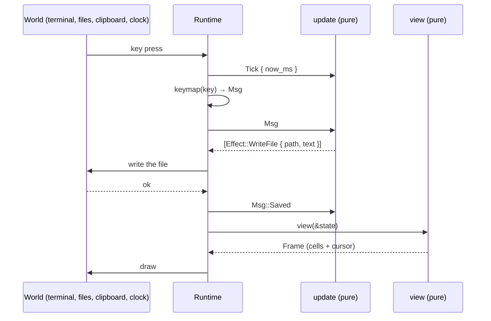
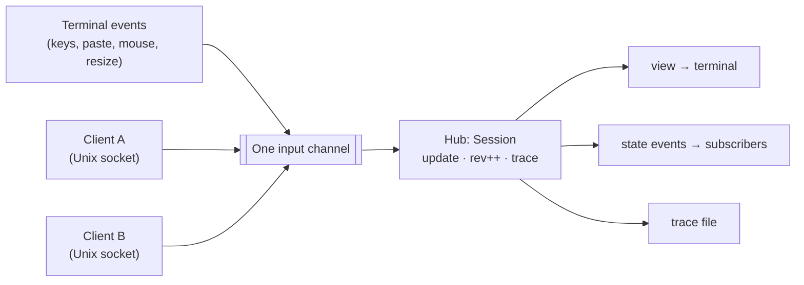

# Architecture

caretline is an Elm architecture around Helix's editing core. This page explains the
pieces, why they're pure, and how that makes every session reproducible.

## The pieces

| Piece | Type | What it is |
|---|---|---|
| State | `State` | Everything that decides the screen and the behaviour. Plain data that serializes to JSON |
| Message | `Msg` | Every input: an edit, a motion, a click, a resize, the clock, a save's result |
| Update | `update(&mut State, Msg) -> Vec<Effect>` | The only place state changes. Pure |
| Effect | `Effect` | Work for the outside world: write a file, set the clipboard, quit |
| View | `view(&State) -> Frame` | A grid of cells plus the caret's cell. Pure |
| Keymap | `keymap(&Key) -> Option<Msg>` | A key to a message. Pure, and separate from `update` |

```rust
use caretline::{keymap, update, view, Key, KeyCode, State, Viewport};

let mut state = State::new("hi", None, Viewport { width: 20, height: 3 });
let msg = keymap(&Key::plain(KeyCode::End)).unwrap();     // Move { forward, line_end }
let effects = update(&mut state, msg);                     // no effects for a motion
assert!(effects.is_empty());
assert_eq!(view(&state).cursor, Some((2, 0)));            // the caret is after "hi"
```

### What `State` holds

`State` is one **document** seen through one **view**: `state.doc` (a `Document`) and
`state.view` (a `View`). Several views can share one document (see
[Documents and views](#documents-and-views)); `State` is the single-view case that the
protocol, traces and the `caretline` binary use. Its JSON is one flat object with both
halves' fields side by side, the shape every earlier state has.

| Field | In | Meaning |
|---|---|---|
| `text` | doc | The document, a `ropey::Rope` (a string in JSON) |
| `selection` | view | Helix `Selection`: one or more ranges, each an `anchor` and a `head` (the caret). `old_visual_position` holds the goal column |
| `scroll` | view | The top of the view: a document `line`, a visual `row` inside it, and a `col` offset when wrapping is off |
| `viewport` | view | `width` × `height` in cells. The last row is the status bar, unless `config.status_bar` is off |
| `clipboard` | doc | The internal register: the last copy or cut, with the marks a cut took. A plain string in JSON when it carries no marks |
| `path` | doc | Where `save` writes, if anywhere |
| `history` | doc | Helix's undo tree |
| `saved_revision`, `saving`, `dirty` | doc | Which history revision is on disk, a save in flight, and whether they differ |
| `config` | both | In JSON one object: `tab_width`, `soft_wrap`, `line_ending` and `external_undo` are the document's (`doc.config`); `scrolloff`, `status_bar` and `follow` the view's (`view.config`) |
| `status` | view | A one-line message for the status bar, cleared by the next input |
| `now_ms` | doc | The clock, as the last `tick` reported it |
| `run` | doc | The open edit run (for undo grouping), with the view it is typed in |
| `quit_armed` | view | A first quit with unsaved changes arms it; the second quits |
| `marks` | doc | Block marks: numeric ids at line starts, mapped through every edit (see [Block marks](#block-marks)). Left out of the JSON when unused |
| `mark_log` | doc | What each history revision did to the marks, by revision. Left out of the JSON when empty |
| `outline` | doc | Set for an [outline document](outline.md): its config (indent, task vocabulary, cycle). Left out when unset |
| `doc_rev` | doc (`rev`) | Goes up by one for every change of the text or the marks, from any view or from elsewhere. Left out while 0 |
| `undo_floor` | doc | The history was trimmed at a change from elsewhere (the barrier fallback). Left out while false |
| `word_drag` | view | The word a `select_word_at` selected, while a shift-click may extend it by words |
| `folds` | view | Folded blocks, by mark id. Left out while empty |
| `read_only` | view | Editing messages are refused. Left out while false |
| `focused` | view | Only a focused view draws its caret. Left out while true |
| `free` | view | Scrolled freely (`scroll_view`): the view doesn't follow the caret until it moves. Left out while false |
| `layout` | view | The [outline layout](outline.md#the-outline-layout). Left out when unset |

Only `text` matters when a state is parsed: every other field is optional and gets what
`State::new` would give (see [Rehydration](#rehydration)).

The document and the view also carry memos that are not part of their value: where the rows
of long soft-wrapped lines start (the view's, see [Long lines](#long-lines)) and an outline
document's derived blocks (the document's). They are never serialized and never affect
equality.

## Documents and views

A `Document` holds what every window on a text shares: the text, marks, undo history,
outline, clipboard register, clock and save state. A `View` holds what one window has: its
selection and goal column, scroll, viewport, folds, status line, follow policy, layout and
whether it may edit.

```rust
use caretline::{update_doc, Msg, State, View, Viewport};

let mut doc = State::new("hello world", None, Viewport { width: 40, height: 5 }).doc;
let mut views = [View::new(Viewport { width: 40, height: 5 }), View::new(Viewport { width: 20, height: 3 })];
views[1].selection = caretline::helix::Selection::point(6); // before "world"
update_doc(&mut doc, &mut views, 0, Msg::InsertText { text: "say ".into() });
assert_eq!(doc.text.to_string(), "say hello world");
assert_eq!(views[1].caret(), 10); // still before "world"
```

`update_doc(doc, views, acting, msg)` applies a message through `views[acting]`:

- **Edits from one view rebase the others.** The text changes it made are mapped through every
  other view's selection, its scroll stays on the text it showed, its folds drop with their
  blocks, and its selection is kept out of block markers and folded blocks. A motion moves no
  other view.
- **Undo is the document's.** It takes back the last step whichever view made it, and puts the
  acting view's selection where that step happened. A typing run belongs to one view: typing
  through another starts a new step.
- **Read-only views** are refused every editing message (`Msg::edits()`): `update_doc` returns
  `Effect::Refused` and changes nothing. Motion, selection, copy and folds still work.
- **Changes from elsewhere** (`Msg::External`) act on the document, not through a view: every
  view is mapped through them, read-only ones included. See
  [Changes from elsewhere](#changes-from-elsewhere).

`update(&mut state, msg)` is `update_doc(&mut state.doc, [&mut state.view], 0, msg)`, and
`view(&state)` is `render(&state.doc, &state.view)`. `Session` keeps other views beside its
state, and the [protocol](protocol.md#views) addresses them by id.

A view follows the caret by its `config.follow`: `margin` (the least scroll that keeps
`scrolloff` rows of margin) or `{"typewriter": {"percent": 45}}` (the caret's row stays at that
share of the height). `scroll_view` scrolls without moving the caret and leaves the view
`free` until the next caret motion or edit.

## Changes from elsewhere

`Msg::External { changes }` applies changes made outside the editor: another device, a
daemon, an agent. Block changes name blocks by mark (`replace_content`, `set_shape`, `set_gap`,
`insert_block`, `remove_block`); `replace` names a char range and works on any document. See
[messages.md](messages.md#changes-from-elsewhere).

Each change becomes a transaction applied **outside the undo history**. A new content changes
only the chars that differ, so carets in the unchanged part stay put. Then:

- every view's selection is mapped through it, and marks follow the plain mapping rules plus
  each change's own (an inserted block takes the host's id; a removed block's mark goes);
- the **history is transformed** over it, so undo takes back only local edits and never the
  change from elsewhere;
- the save point, the open edit run and the mark log stay on the revisions they belong to, so
  an undo back to the save point is clean again and typing continues its undo step.

The message is passive: it doesn't end a typing run or clear the status.

### The history transform

Helix's `ChangeSet::map` (upstream `unimplemented!()`) is the standard operational transform
over retain, insert and delete: `a.map_ordered(b, before)` turns `a` into a change that applies
after `b`, such that `b ∘ a' == a ∘ b'`. Deletions win, and insertions from both sides are
kept. `History::rebase_over(remote, doc)` walks from the current revision back to the root:

- each inversion `I_k` becomes `I_k.map(R_k)`, where `R_k` is the remote change as it applies
  to revision `k`'s document;
- the remote change moves one revision back: `R_{k-1} = R_k.map(I_k, before)`;
- each transaction becomes the inverse of its new inversion, and the stored selections are
  mapped the same way.

Revisions off the path from the root to the current one are dropped: redo past a change from
elsewhere is gone. When an undo step and the change touch the same chars, the change wins:
undo can't bring back what elsewhere deleted. The cost is linear in the history (about 5 ms
for 5,000 revisions in a release build).

`config.external_undo: "barrier"` is a fallback: a change from elsewhere trims the history
instead, and undo stops there with `undo stops at a change from elsewhere`.

## The update loop

A runtime turns the world into messages, feeds them to `update`, performs the effects and
feeds any results back as messages. Then it draws `view`.



The interactive `caretline` binary is exactly this loop
([`runtime.rs`](../../crates/caretline-app/src/runtime.rs)). Before each batch of messages
from a terminal event, it sends a `Tick` with the wall clock.

## Why purity

`update` reads no clock, uses no randomness and does no I/O. Three things follow.

- **Time is an input.** The runtime reports the time in `Msg::Tick { now_ms }`. `update`
  stores it in `state.doc.now_ms`, and undo grouping compares those timestamps. Helix's
  `History` normally reads `Instant::now()`; the vendored copy takes caller-supplied
  milliseconds instead.
- **I/O is an output.** `save` doesn't write a file; it returns
  `Effect::WriteFile { path, text }`. A test can assert on that value. A headless run can
  print it. A runtime writes the file and answers `Msg::Saved` or `Msg::SaveFailed`.
- **The same inputs give the same state.** So a recorded session is just the initial state
  plus its messages.

### Undo grouping, worked through

Typing, `Backspace` and `Delete` each open a *run*. The next edit of the same kind amends the
same history revision if:

- it comes less than 1500 ms (`RUN_GAP_MS`) after the run's last edit, by `now_ms`,
- nothing else (a motion, a click, an undo) happened in between,
- it didn't replace a selection, and
- the run is not full (below).

`tick`, `resize`, `saved` and `save_failed` are *passive*: they never end a run.

A run is **full**, and the next edit starts a new undo step, once it has inserted or deleted
256 characters (`RUN_MAX_CHARS`). A typing run also breaks earlier at a word: once it holds
128 characters (`RUN_WORD_BREAK_CHARS`), text that starts with whitespace begins a new step.
So text streamed one character per message (an agent typing, or a fast typist who never
pauses) undoes a phrase of 128 to 256 characters at a time, each step starting at the space
before a word, instead of all at once. The cap also keeps every edit's cost bounded: amending
a revision recomposes its changes, which costs time linear in the run's length.

```rust
use caretline::{update, Msg, State, Viewport};

let mut s = State::new("", None, Viewport { width: 40, height: 3 });
for (now, text) in [(0, "one"), (500, " two"), (3000, " three")] {
    update(&mut s, Msg::Tick { now_ms: now });
    update(&mut s, Msg::InsertText { text: text.into() });
}
update(&mut s, Msg::Undo);
assert_eq!(s.doc.text.to_string(), "one two"); // " three" came 2.5 s later: its own step
update(&mut s, Msg::Undo);
assert_eq!(s.doc.text.to_string(), "");        // "one" and " two" were one run
```

## Revisions and determinism

There are two kinds of revision.

| Revision | Where | Counts |
|---|---|---|
| History revision | `state.doc.history.current_revision()` | Undo steps. A typing run amends one revision; undo moves back along the tree. `saved_revision` and `dirty` are defined against it |
| Session rev | `Session::rev()` | Every message applied and every state replacement, +1 each. Clients of the [protocol](protocol.md) use it to detect changes they missed |

**Dirty** is `saved_revision != history.current_revision()`. Undoing back to the saved
revision makes the document clean again.

### Traces make sessions reproducible

A trace is JSON Lines. The first line is `{"state": …}`, and every later line is
`{"msg": …}`. The interactive runtime records every message it applies, including the
clock ticks and the save results its effects produced. So
`caretline::trace::replay_trace` reproduces the session exactly:

```text
{"state": {"text": "Selections have an anchor …", "selection": …, "history": …}}
{"msg": {"msg": "tick", "now_ms": 1000}}
{"msg": {"msg": "move", "dir": "forward", "by": "word"}}
{"msg": {"msg": "move", "dir": "forward", "by": "word", "extend": true}}
{"msg": {"msg": "tick", "now_ms": 1400}}
{"msg": {"msg": "insert_text", "text": "h"}}
```

A later `state` line (a session restarted into the same file, a `state.set`, or a
checkpoint) resets the state, and the replay continues from there.

`Session` keeps its trace in memory as **segments**: each starts with a `state` line (the
initial state, a `state.set`, or a `trace.checkpoint`) and holds the messages since, so each
segment replays on its own. A long-lived session keeps at most `DEFAULT_TRACE_LIMIT` (100,000)
lines, `Session::set_trace_limit` or `--trace-limit` to change it: past the limit it drops
the segments before the current one, and a segment that alone outgrows the limit is cut by an
automatic checkpoint. A `--trace` file is separate and keeps everything. See
[protocol.md](protocol.md#traces).

### Rehydration

`State::from_json` parses a state, then calls `sanitize`, which repairs anything a
hand-edited file could get wrong:

- Selection positions are clamped to the text and moved back to a grapheme boundary.
- An empty selection becomes a caret at 0.
- A zero viewport becomes 1 × 1, and a zero tab width becomes 1.
- A scroll line past the end resets to the top.
- A history whose current revision doesn't exist resets to empty.
- `dirty` is recomputed.

Parsing also fills in what's missing. Every field but `text` is optional (and `text` defaults
to empty): `selection` is a caret at 0, `viewport` 80 × 24, `scroll` the top, `history` fresh,
`run`, `status`, `saving` and `path` none, `now_ms` 0, and `config` the defaults, with the
line ending detected from the text. A missing `saved_revision` means saved at the current
history revision, so a pushed state starts clean; `"saved_revision": null` means never saved.
Inside `selection`, `old_visual_position` and `primary_index` are optional too. This is the
minimal state a client can push:

```json
{"text": "hello\nworld\n", "selection": {"ranges": [{"anchor": 0, "head": 5}]},
 "viewport": {"width": 40, "height": 10}, "config": {"soft_wrap": false}}
```

`State::without_history()` serializes a state without its undo history, writing
`saved_revision` as `0` (clean) or `null` (dirty) so that it rehydrates to the same document
and view with a fresh history; `State::history_part()` is what it leaves out (see
[protocol.md](protocol.md#the-state-without-its-history)).

On any state `update` produced, `sanitize` changes nothing. So `to_json` followed by
`from_json` gives back an equal state, with the same frame and the same future behaviour.
The goal column and an open typing run survive the trip too.

## The runtime merges inputs into one queue

With the [state protocol](protocol.md), a live editor has two sources of input: the
terminal and protocol clients on a Unix socket. The runtime puts them on **one channel**, so
`update` sees a single order of messages, and that order is what the trace records.



The editor drains everything already queued, then redraws once, only if the rev changed, and
at most once per refresh (`--max-fps`, default 120): a change that comes in a refresh slot that
has already painted waits for the next one. While the view asks for a frame clock
(`Msg::FrameClock`), the runtime also sends a `Msg::Frame { now_ms }` on that schedule. See
[performance.md](performance.md#how-the-live-editor-paints).
The runtime also stamps time: before a client's messages it applies a `tick` with the real
time (outside `update`, as for keys), so the trace still replays exactly.

## Helix inside State

The vendored Helix files live in
[`crates/caretline/src/helix`](../../crates/caretline/src/helix). Here is how they
map into caretline.

| Helix | In caretline | How it's used |
|---|---|---|
| `Rope` (ropey) | `Document.text` | The document. Serialized as a plain string |
| `Selection`, `Range` | `View.selection` | Anchor and head per range, a primary index, and `old_visual_position` for the goal column. Derives serde |
| `Transaction`, `ChangeSet` | Built inside `update` | Each edit builds one change per range, applies it to the rope, and sets the new selection. `ChangeSet::map` (a caretline implementation) transforms one change over another |
| `Selection::map` | Undo and redo | When a history transaction has no selection, the current one is mapped through its changes |
| `History` | `Document.history` | The revision tree. `commit_revision_at_timestamp` takes caller time; `amend_current_revision` (a caretline addition) folds a typing run into one revision; `rebase_over` (a caretline addition) transforms it over a change from elsewhere |
| `graphemes` | Motion and deletes | `next_grapheme_boundary` and `prev_grapheme_boundary` keep every position on a boundary |
| `DocumentFormatter`, `TextFormat` | `layout.rs` and `view.rs` | Soft wrap, tab stops and visual positions. Wrapping needs more than 10 columns. `resume_at_row` (a caretline addition) starts it inside a long line |
| `LineEnding` | `Config.line_ending` | Detected from the text on load. Enter inserts it and pasted text is normalized to it |

What changed from upstream Helix is listed in
[`src/helix/README.md`](../../crates/caretline/src/helix/README.md): module paths, no
tree-sitter or regex, caller-supplied timestamps, serde derives, and resuming the formatter
at a row.

### Long lines

Helix's formatter lays a line out from its start, so finding the caret's row on a long
soft-wrapped line costs time linear in the line's length, and typing a long paragraph one
character at a time would cost quadratic time overall. For lines of 256 characters or more
(`LONG_LINE_CHARS`), layout remembers where each visual row starts (`WrapCache`, a memo in the
state) and restarts the formatter at the nearest known row with
`DocumentFormatter::resume_at_row`. An edit keeps the row starts before it, less two rows of
margin (a row's start depends only on the text before it and the next row), so typing at the
end of a long line re-lays about three rows. The memo is derived data: a property test checks
that states, frames, coordinates and row counts match layout from scratch after random
edits, motions, undos and resizes.

## Block marks

A mark is a `MarkId` (a plain `u64`) at a char position that is always the start of a line.
Marks are block identity: the [outline layer](outline.md) puts one on the first line of every
block, and a host keys its own data (a database row, a node id) by them. The engine only
hands out numbers, from a counter in `Marks` that never goes back, so an id is never reused.
Each mark also carries `BlockAttrs` (today a block's `gap`, its blank row before it).

**Mapping.** After every transaction each mark is mapped with `Assoc::After` and snapped to
the start of its line:

| Edit | What happens to the mark |
|---|---|
| Typing at a line's start | It stays on the line |
| A line break typed at a mark | The mark moves down with the text after the break; the new line above has none |
| A line break typed mid-line | Nothing moves: the new line has no mark |
| Deleting the line break before a mark (Backspace at a line start) | The mark is removed: its line joined the one above |
| Deleting a selection that spans lines | The first line keeps its mark; marks on the lines the deletion reached are removed |
| Deleting (or cutting) whole lines: from a line start to a line start, nothing typed in their place | Those lines' marks are removed; the line after keeps its own |
| Deleting the start of a line (a marker such as `- `) | The mark stays |

If two marks would land on one line, the one that was earlier keeps it. Every removed mark is
recorded.

**Undo and redo.** History revisions don't hold marks. `mark_log[r]` holds revision `r`'s
`MarkDelta`: fix-ups applied after mapping the marks through the revision's inversion (undo)
or transaction (redo). They are computed when the revision is made, by comparing the plain
mapping with the marks the edit left, so undo and redo restore every mark, id and attribute
exactly, typing runs included. Mapping costs time in the marks after the first change; a
document without marks pays nothing.

**Cut and paste.** A cut of one range keeps the marks it removed in the register, as offsets
into the cut text. Pasting the register (or the same text from the system clipboard) puts each
one back where its offset lands on a line start, unless that id is in use. So a cut and a paste
in one session move blocks with their ids, and cut then paste in place gives back the same
marks.

## Outline documents

With `state.doc.outline` set, the same buffer is read as blocks bounded by marks (one text line
per row, a block's first line carrying its indentation and marker, other lines continuing
it). `update` hands Enter, Backspace, Delete, Tab, the task cycle, moves, copy and paste to
the outline's rules first (`outline::rules`), which build ordinary Transactions with explicit
mark edits. Every commit then marks new block starts, and after every message the selection
is kept out of markers and atomic blocks. Layout adds a virtual row before each block with a
blank row, and with a view's [outline layout](outline.md#the-outline-layout) lays each line out
at its own column and width. See [outline.md](outline.md).

## What `update` does after every message

After handling any message, `update` always:

1. in an outline document, moves selection ends out of folded blocks, keeps them out of
   markers and atomic blocks, and reports `block_left` (and `restored`, `notice`),
2. recomputes `dirty`,
3. closes the edit run if history moved past it, and
4. scrolls so the primary caret is visible, by the view's follow policy (unless the view was
   scrolled freely and the caret hasn't moved since).

`update_doc` then rebases every other view through the text changes.

So no runtime needs to fix up scrolling after a resize or an edit.
