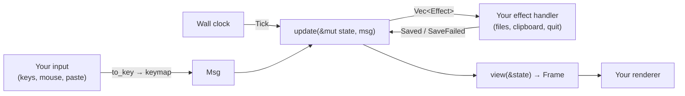

# Embedding caretline

There are two ways to put caretline in your project:

| Way | You get | Best when |
|---|---|---|
| [As a library](#as-a-library) | `State`, `update` and `view` in your Rust process | Your app is in Rust and owns its terminal or window |
| [As a process](#as-a-process) | `caretline serve` speaking JSON lines | Your app is in another language, or you want isolation |

Either way, caretline owns the editing rules and you own everything else: input, drawing,
files, the clipboard and the clock.

## As a library

### Add the dependency

caretline is on [crates.io](https://crates.io/crates/caretline): `cargo add caretline`, or

```toml
[dependencies]
caretline = "0.2"
```

Its library is `caretline::`; this repository's crate is the same code. For something on
`main` that is newer than the latest release, use a git dependency on this repository.

The crate has no terminal dependency, so it works
under any renderer.

### Your event loop

You own the loop. Each turn:

1. Turn your input into a `Msg`. For keys, convert to `caretline::Key` and call
   `keymap`; for paste, resize and mouse events, build the message directly.
2. Send `Msg::Tick { now_ms }` with the wall clock, so typing groups into undo steps.
3. Call `update` and perform the effects it returns.
4. Call `view` and copy the cells to your screen. Put your cursor at `frame.cursor`.



### A minimal ratatui embed

A complete editor in one file, with ratatui 0.30 and crossterm 0.29. It types, moves,
selects and undoes; `Ctrl-Q` twice quits and prints the text.

```toml
[dependencies]
caretline = "0.2"
ratatui = "0.30"
crossterm = "0.29"
```

```rust
use std::time::{SystemTime, UNIX_EPOCH};

use caretline::view::Role;
use caretline::{keymap, update, view, Effect, Key, KeyCode, Mods, Msg, State, Viewport};
use crossterm::event::{self, Event, KeyEventKind, KeyModifiers};
use ratatui::layout::Rect;
use ratatui::style::{Modifier, Style};
use ratatui::Frame;

/// Your key type to caretline's. Keys caretline doesn't know return None.
fn to_key(k: &event::KeyEvent) -> Option<Key> {
    use event::KeyCode as C;
    let code = match k.code {
        C::Char(c) => KeyCode::Char(c),
        C::Enter => KeyCode::Enter,
        C::Backspace => KeyCode::Backspace,
        C::Delete => KeyCode::Delete,
        C::Left => KeyCode::Left,
        C::Right => KeyCode::Right,
        C::Up => KeyCode::Up,
        C::Down => KeyCode::Down,
        C::Home => KeyCode::Home,
        C::End => KeyCode::End,
        C::PageUp => KeyCode::PageUp,
        C::PageDown => KeyCode::PageDown,
        C::Tab => KeyCode::Tab,
        C::Esc => KeyCode::Esc,
        _ => return None,
    };
    let m = k.modifiers;
    let mods = Mods {
        shift: m.contains(KeyModifiers::SHIFT),
        ctrl: m.contains(KeyModifiers::CONTROL),
        alt: m.contains(KeyModifiers::ALT),
        cmd: m.contains(KeyModifiers::SUPER),
    };
    Some(Key { code, mods })
}

/// Copies caretline's frame into a ratatui area. The status row is the frame's last row.
fn draw_editor(f: &mut Frame, area: Rect, state: &State) {
    let frame = view(state);
    let buf = f.buffer_mut();
    for y in 0..frame.height.min(area.height) {
        for x in 0..frame.width.min(area.width) {
            let cell = frame.cell(x, y);
            if cell.symbol.is_empty() {
                continue; // the second half of a wide grapheme
            }
            let style = match cell.role {
                Role::Text => Style::default(),
                Role::Selection => Style::default().add_modifier(Modifier::REVERSED),
                Role::Status | Role::StatusAccent => Style::default().add_modifier(Modifier::DIM),
            };
            buf.set_string(area.x + x, area.y + y, &cell.symbol, style);
        }
    }
    if let Some((x, y)) = frame.cursor {
        f.set_cursor_position((area.x + x, area.y + y));
    }
}

fn now_ms() -> u64 {
    SystemTime::now().duration_since(UNIX_EPOCH).map(|d| d.as_millis() as u64).unwrap_or(0)
}

fn main() -> std::io::Result<()> {
    let mut terminal = ratatui::init();
    let size = terminal.size()?;
    let mut state = State::new("Edit me.\n", None, Viewport { width: size.width, height: size.height });

    'outer: loop {
        terminal.draw(|f| draw_editor(f, f.area(), &state))?;
        let msg = match event::read()? {
            Event::Key(k) if k.kind == KeyEventKind::Press => match to_key(&k).and_then(|k| keymap(&k)) {
                Some(msg) => msg,
                None => continue,
            },
            Event::Paste(text) => Msg::Paste { text: Some(text) },
            Event::Resize(width, height) => Msg::Resize { width, height },
            _ => continue,
        };
        update(&mut state, Msg::Tick { now_ms: now_ms() });
        for effect in update(&mut state, msg) {
            match effect {
                Effect::Quit => break 'outer,
                Effect::ClipboardSet { .. } => {} // hand it to your clipboard
                Effect::WriteFile { .. } => {}    // write it, then send Msg::Saved
            }
        }
    }
    ratatui::restore();
    println!("{}", state.doc.text);
    Ok(())
}
```

For a fuller runtime (mouse, the system clipboard, atomic saves, kitty keyboard flags,
traces), read the `caretline` binary's
[`runtime.rs`](../../crates/caretline-app/src/runtime.rs).

Notes for your own renderer:

- The frame's size is the state's viewport. When your area changes size, send
  `Msg::Resize`; `update` keeps the caret in view.
- The last row of every frame is caretline's status bar (file name, `[+]`, messages,
  `line:col`). There's no option to turn it off yet; if you don't want it, give the state one
  extra row and don't copy the last one.
- Mouse cells map directly: send `Msg::Click { col, row, extend }` with coordinates relative
  to your area, and `Msg::Scroll { rows }` for the wheel.

### Panels: several independent editors

Each `State` is a whole editor with its own text, selection, undo history and viewport. For
several panels, keep several states. Route input to the focused one and give each its own
area.

```rust
use caretline::{update, Effect, Msg, State, Viewport};
use ratatui::layout::{Constraint, Layout, Rect};

/// One editor per panel. Each has its own text, selection, undo history and viewport.
struct Panels {
    editors: Vec<State>,
    focus: usize,
    clipboard: String, // shared between panels
}

impl Panels {
    fn new(texts: &[&str]) -> Panels {
        let vp = Viewport { width: 1, height: 1 }; // set by layout() before the first draw
        Panels {
            editors: texts.iter().map(|t| State::new(t, None, vp)).collect(),
            focus: 0,
            clipboard: String::new(),
        }
    }

    /// Splits the screen and tells each editor its size.
    fn layout(&mut self, area: Rect) -> Vec<Rect> {
        let n = self.editors.len() as u32;
        let rects = Layout::horizontal((0..n).map(|_| Constraint::Ratio(1, n))).split(area);
        for (state, r) in self.editors.iter_mut().zip(rects.iter()) {
            if (state.view.viewport.width, state.view.viewport.height) != (r.width, r.height) {
                update(state, Msg::Resize { width: r.width, height: r.height });
            }
        }
        rects.to_vec()
    }

    /// Input goes to the focused editor only. Paste uses the shared clipboard.
    fn send(&mut self, msg: Msg) {
        let msg = match msg {
            Msg::Paste { text: None } => Msg::Paste { text: Some(self.clipboard.clone()) },
            m => m,
        };
        for effect in update(&mut self.editors[self.focus], msg) {
            if let Effect::ClipboardSet { text } = effect {
                self.clipboard = text;
            }
        }
    }
}
```

Draw each panel with `draw_editor(f, rects[i], &panels.editors[i])` from the example above.

- **The clipboard register is per state.** To share copy and paste between panels, keep
  the text from `ClipboardSet` yourself and paste it with `Paste { text: Some(..) }`, as
  above.
- **Saving and undo are per state.** Give each state its own `path`.
- **Two panels on the same document** aren't supported: each state owns its text. Edits in
  one don't reach another.
- **Persist the layout** by saving each state with `to_json`. Reopening restores the text,
  the caret, the scroll and the undo history.

## As a process

Spawn `caretline serve`, write JSON requests to its stdin and read one JSON response per
line from its stdout. Any language that can run a process works.

```python
import json, subprocess

class Caretline:
    """A caretline engine in a child process, spoken to in JSON lines."""

    def __init__(self, *args):
        self.proc = subprocess.Popen(
            ["caretline", "serve", *args],
            stdin=subprocess.PIPE, stdout=subprocess.PIPE, text=True,
        )
        self.next_id = 0

    def call(self, op, **fields):
        self.next_id += 1
        req = {"id": self.next_id, "op": op, **fields}
        self.proc.stdin.write(json.dumps(req) + "\n")
        self.proc.stdin.flush()
        resp = json.loads(self.proc.stdout.readline())
        if "error" in resp:
            raise RuntimeError(f"{resp['error']['kind']}: {resp['error']['message']}")
        return resp["result"]

    def close(self):
        self.proc.stdin.close()
        self.proc.wait()

ed = Caretline("py.md", "--size", "30x4")
print(ed.call("hello")["proto"])
rev = ed.call("keys", keys="<d-down>written from Python")["rev"]

# Save: the engine returns a write_file effect; performing it is your job.
for effect in ed.call("msgs", msgs=[{"msg": "save"}], if_rev=rev)["effects"]:
    if effect["effect"] == "write_file":
        with open(effect["path"], "w") as f:
            f.write(effect["text"])
        ed.call("msgs", msgs=[{"msg": "saved"}])
print(ed.call("render")["frame"], end="")
ed.close()
```

With `py.md` containing `hello world`, this prints:

```text
1
hello world
written from Python

 py.md  saved py.md      2:20
```

- Don't `subscribe` on a connection you read like this: events arrive between responses.
  Use a second connection on a socket (`serve --socket`) for events.
- To show the editor in your UI, ask for `render` with `format: "cells"` and draw the rows
  and spans yourself.
- One `serve` process is one editor. For several panels, start several.
- `serve --no-status-bar` gives every row to text, for a panel that draws its own chrome.
- `serve` ticks to the real time before each request, so typing groups into undo steps by
  time. Pass `now_ms` on a request, or start `serve --no-clock`, to control time yourself.

## Licensing

| Code | License |
|---|---|
| `caretline`, except `src/helix/` | MIT |
| its `src/helix/` (vendored from Helix) | MPL-2.0, per file |
| `caretline-cli` | MIT |

MPL-2.0 is a **file-level** copyleft. In practice, for an embedder:

- **Your own code can use any license**, open or closed. Linking caretline into your
  program doesn't change your files' license.
- **The vendored Helix files stay MPL-2.0.** If you distribute a program that contains them,
  you must make the source of those files available, including any changes you make to them,
  under MPL-2.0. Unchanged files are already public in this repository and upstream.
- **Keep the notices.** Each vendored file names its upstream source and its changes, and
  `src/helix/LICENSE-MPL-2.0` holds the license text.
- The crate's `license` field is `MIT AND MPL-2.0`, so license scanners see both.

This is a summary, not legal advice. Read the
[MPL-2.0 FAQ](https://www.mozilla.org/en-US/MPL/2.0/FAQ/) if it matters for your project.
