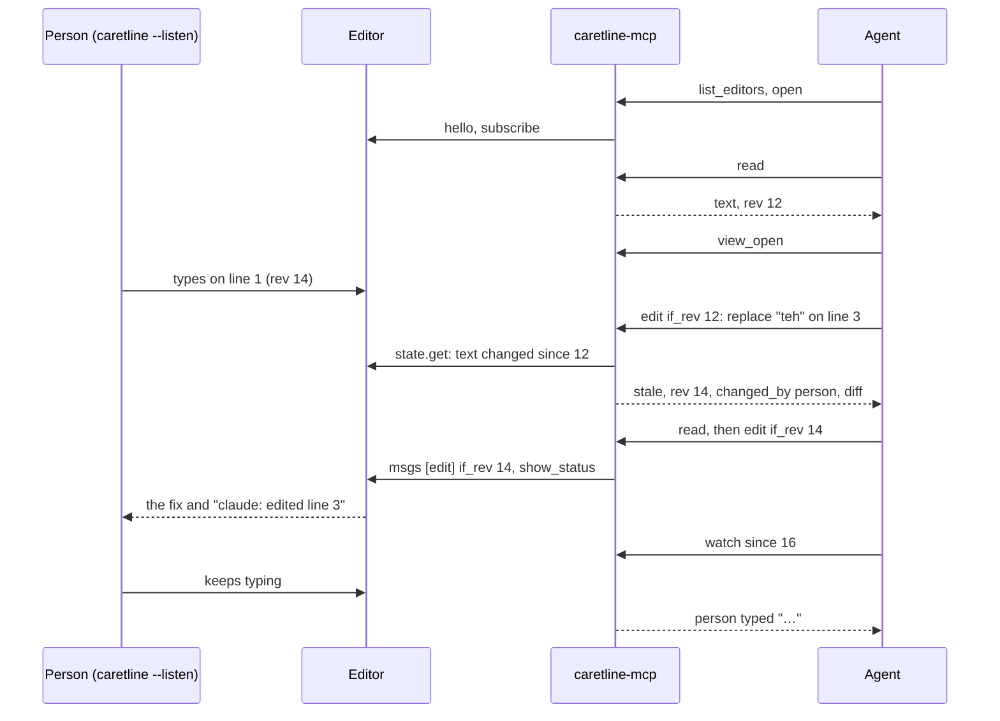

# The MCP server

`caretline-mcp` is a [Model Context Protocol](https://modelcontextprotocol.io) server that
gives an agent a caretline editor to work in. The agent can attach to a **live editor a person
is typing in** and edit alongside them, or start a **headless engine** on a file. Either way
it reads a revision number with the text, and every write names that revision.

```console
$ caretline notes.md --listen                     # the person, in one terminal
$ claude mcp add caretline -- caretline-mcp       # the agent, once
```

## Why

Agents usually edit files with search and replace on text they read earlier. When the file
changes in between (the person typed, a formatter ran, another agent got there first), the
edit fails or, worse, lands in the wrong place. A text editor that is open on the file can't
see the agent at all.

caretline is an editing engine whose whole state is one value, with a
[revision](protocol.md#revisions) that goes up with every change and a trace that replays
exactly. Over the [state protocol](protocol.md), `caretline-mcp` turns that into tools an agent
can use safely:

- **Guarded writes.** Every edit carries `if_rev`, the rev of the text the agent read. If the
  text changed since, nothing is written, and the agent gets the current rev, who changed it
  and a diff. A caret move or a clock tick is not a text change, so typing elsewhere in the
  person's cursor doesn't block the agent, but typing in the text does.
- **Edits by meaning, not by luck.** Replace by a search that must match exactly once, by
  line and column, insert at a position, or play keys through the editor's own keymap.
- **Its own caret.** The agent opens its own view, so its selection and typing never move the
  person's caret. The person's edits move it only as the text shifts.
- **Attribution.** The person sees `claude: edited line 3` in the status bar. `watch` tells the
  agent whether a change came from the person at the keyboard, another client or itself.
- **Exact replay.** The trace of a session, the person's keys and the agent's edits in the
  order the editor applied them, replays with `caretline --replay` to the same text, carets and
  frame.
- **Saves only on request.** Nothing the agent does writes the file except the `save` tool.

## Install

```sh
cargo install --locked --path crates/caretline-app   # the editor: `caretline`
cargo install --locked --path crates/caretline-mcp   # the server: `caretline-mcp`
```

`caretline-mcp --help` lists the flags; `caretline-mcp --list-tools` prints the tool
definitions as JSON.

## Set it up

### Claude Code

```sh
claude mcp add caretline -- caretline-mcp
```

Add flags after the command, for example a read-only server:
`claude mcp add caretline-ro -- caretline-mcp --read-only`.

### Claude Desktop

In `claude_desktop_config.json` (on macOS in `~/Library/Application Support/Claude/`):

```json
{
  "mcpServers": {
    "caretline": { "command": "caretline-mcp", "args": [] }
  }
}
```

Use the binary's full path if Claude Desktop doesn't see your shell's `PATH`
(`which caretline-mcp`).

### Cursor

In `~/.cursor/mcp.json`, or `.cursor/mcp.json` in a project:

```json
{
  "mcpServers": {
    "caretline": { "command": "caretline-mcp", "args": [] }
  }
}
```

### Flags

| Flag | Does |
|---|---|
| `--read-only` | Refuses `edit` and `save`. The agent can list, open, read, watch and trace. Its view is opened read-only |
| `--quiet` | No `name: edited line N` in the live editor's status bar |
| `--name NAME` | The name edits are announced under (default: the MCP client's name, such as `claude-code`) |
| `--allow-unguarded` | Accepts `edit` without `if_rev`. Not recommended |
| `--list-tools` | Prints the tool definitions and exits |

The server speaks MCP over stdio, protocol versions 2024-11-05 through 2026-07-28, built on
the official Rust SDK ([`rmcp`](https://crates.io/crates/rmcp)).

## How a session goes



## Tools

Positions are `{"line": L, "col": C}`, both 1-based, the column in characters. `col` one past
the line's last character is the end of the line. Every tool takes an optional `session` (the
id `open` returned), which may be left out when only one session is open.

### `list_editors`

The live editors on this machine, newest first: `pid`, `file`, `socket`, `started_ms`, and
`alive` (its socket answers). They come from the [discovery files](protocol.md#discovery)
listening editors write to `$TMPDIR/caretline/`. Also lists this server's open sessions.

### `open`

| Argument | Opens |
|---|---|
| (none) | The newest live editor |
| `pid` | The live editor with that process id |
| `socket` | The editor or `caretline serve --socket` on that Unix socket |
| `file` | A headless engine on that file, in this process (created on save if missing) |
| `text` | A headless engine on that text, with no file |
| `outline`, `layout` | Headless: an [outline document](outline.md) (with the outline layout) |
| `width`, `height` | Headless: the viewport (80x24) |

Returns `session`, `live`, `file`, `pid`, `socket`, `rev`, `lines` and `dirty`. Attaching
changes nothing in the editor.

### `read`

The text with `rev`, `lines`, `dirty` (unsaved), and `carets`: the person's caret and
selection, and the agent's once it has a view. `from_line` and `to_line` read a range. The
text comes as a second content block, numbered (`  3│ text`) unless `numbered: false`; the
structured result's `text` is always raw.

With `render: true` (or `{width, height}`), it returns the screen instead: the agent's view
(or the person's, with `view: "person"`) drawn as text, as the editor would draw it, and the
cursor cell.

### `edit`

```json
{"if_rev": 12, "ops": [{"kind": "replace", "search": "teh cat", "text": "the cat"}]}
```

| Op | Fields | Does |
|---|---|---|
| `replace` | `search`, `text` | Replaces the one place `search` occurs. 0 matches is `not_found`, 2 or more is `ambiguous` with where they are: add surrounding text |
| `replace_range` | `from`, `to`, `text` | Replaces `[from, to)`. `text: ""` deletes |
| `insert` | `at`, `text` | Inserts at a position |
| `select` | `from`, `to` | Selects `[from, to)` in the agent's view (`to` left out: a caret) |
| `keys` | `keys` | Plays a [key script](messages.md#key-scripts) through the editor's keymap, in the agent's view |

- **Text operations** (`replace`, `replace_range`, `insert`) in one edit are all resolved
  against the text read at `if_rev` and applied as one change (they must not overlap).
  **Caret operations** (`select`, `keys`) go in their own edit; in a live editor they need
  `view_open` first, so they never move the person's caret.
- **The guard.** `if_rev` is required. When the text at `if_rev` is not the text now, the edit
  is refused with `{"error": "stale", "rev", "changed_by", "diff"}` and nothing is written.
  Read again and redo it. A rev this session never read counts as stale unless it is the
  current one. Between the check and the write the engine checks the rev itself (the
  protocol's `if_rev`), so nothing can slip in between.
- **Undo.** With `undo: "shared"` (the default) the edit is one step in the document's undo
  history: it never joins the person's typing run, the person's Ctrl-Z can take it back, and
  it marks the document unsaved. With `undo: "outside"` it is applied as a
  [change from elsewhere](messages.md#changes-from-elsewhere): the person's undo skips it and
  takes back only their own typing, but the document doesn't count it as unsaved, so it can
  be lost if the person quits without another edit.
- **Effects are never performed.** `keys` with `<c-s>` or `<c-q>` returns the `write_file` or
  `quit` effect and does nothing else.

The result has the new `rev` (use it as the next `if_rev`), `previous_rev`, `dirty`, a line
`diff` of what changed, and the agent's caret.

### `view_open` / `view_close`

Opens the agent's own [view](protocol.md#views) (`width`, `height`, default 80x24), starting at
the person's caret. Its selection, scroll and folds are its own; the text, marks and undo
history are shared. Text edits go through it too, so the agent's caret follows its edits.

### `watch`

Waits for changes after `since_rev` and returns them grouped by who made them:

```json
{"rev": 31, "since_rev": 18, "timed_out": false, "text_changed": true,
 "changes": [{"who": "person", "from_rev": 20, "to_rev": 31, "actions": ["typed \"Ship it\"", "delete_backward"]}],
 "diff": {"summary": "line(s) 4-4 changed", "first_line": 4, "old_lines": ["Ship"], "new_lines": ["Ship i"]}}
```

`who` is `person` (the keyboard), `another client` (another program or agent on the
socket), `this agent` (left out unless `include_own`) or `editor` (startup, resizes). Clock
ticks and resizes are left out unless `include_noise`. It returns at the first change, after
`settle_ms` (400) more so a typed word arrives whole, or after `timeout_ms` (20000).

### `trace`

The session's [trace](protocol.md#traces) as JSON Lines: by default the current segment,
which starts with a `state` line and replays on its own; `since_rev` gives only the lines
after that rev; `all` everything kept. `path` writes it to a file:

```console
$ caretline --replay session.jsonl --dump-state -     # the same text, carets and history
$ caretline --replay session.jsonl --snapshot 80x24   # the same frame
```

### `save`

Writes the document to its file, the way Ctrl-S would in the editor: the live editor performs
the `write_file` effect, or the headless engine writes it. The tool description tells the model
to call it only when the user asked.

### `close`

Closes the agent's view and detaches. The live editor keeps running.

## Worked example: a typo fixed while you type

The person writes in one terminal:

```sh
printf 'Teh plan\n\nShip it on fryday.\n' > plan.md
caretline plan.md --listen
```

and asks the agent, "fix the typos in the plan I have open". The agent:

1. `list_editors`, then `open` with no arguments: session `s1`, the editor on `plan.md`.
2. `read`: rev 6, `1│ Teh plan`, `3│ Ship it on fryday.`
3. `view_open`, so its caret is its own.
4. `edit {"if_rev": 6, "ops": [{"kind": "replace", "search": "Teh", "text": "The"}, {"kind": "replace", "search": "fryday", "text": "Friday"}]}`:
   both in one change, rev 9. The person sees the line change and `claude-code: edited line 1`.

Meanwhile the person has started typing a new line at the end. Had they typed before step 4,
the edit would have come back `stale` with `changed_by: ["person"]` and the new line in the
diff; the agent reads again and sends the same edit with the new rev. Typing never lands in
the middle of an agent's edit, and an agent's edit never lands on text it hasn't seen.

The person saves with Ctrl-S when they're happy. The agent saves only if asked to.

The example client `crates/caretline-mcp/examples/agent_session.rs` runs this against a live
editor, with a stale edit and a watch:

```sh
cargo run -p caretline-mcp --example agent_session
```

## Safety

**Read-only mode.** `--read-only` refuses `edit` and `save` and opens the agent's view
read-only, so the agent can follow along (`read`, `watch`, `trace`) and change nothing.

**Saves.** Only the `save` tool performs a `write_file` effect. Edits and key scripts return
effects without performing them, so `<c-s>` or `<c-q>` in a key script neither writes nor
quits. `trace` with `path` writes the trace file, nothing else.

**Threat model.** The server runs as you, on your machine, and adds no network surface: MCP
runs over its stdin and stdout, and it reaches editors only through local Unix sockets.

- A listening editor's socket is `$TMPDIR/caretline-<pid>.sock`, or
  `/tmp/caretline-<uid>/<pid>.sock` (a mode 0700 directory) when `$TMPDIR` is too long. On
  macOS `$TMPDIR` is a per-user directory. Where it is `/tmp`, the socket gets your umask's
  permissions, and connecting needs write permission on it, so with the usual umask (022)
  only you can connect. **Any process running as you can connect to it** and read or edit
  the document; `caretline-mcp` is one such client
  and has no more access than `caretline send`. Don't run `--listen` on a document you
  wouldn't let your own processes read.
- Discovery files in `$TMPDIR/caretline/` only point at sockets. Before connecting, the server
  checks that the socket belongs to your user, so a file planted in a shared directory can't
  point an agent at someone else's server.
- An agent connected through MCP can do what its tools allow: with the default flags, edit
  any document it can open, headless files included (`open {file}` reads any file you can
  read, and `save` writes it). Use `--read-only`, or your MCP client's per-tool approval, to
  narrow that. The tool annotations mark `edit` and `save` as destructive and the read tools
  as read-only for clients that ask before each call.
- Everything the agent does is in the trace, so a session can be audited and replayed.

## Limits

- One document per editor; the agent works on whatever file the editor has open.
- Unix sockets only, so live attach doesn't run on Windows yet (headless sessions do).
- `select` reopens the agent's view with the new selection (views have no message to set
  one), so the view's id changes; the server keeps track of it.
- `watch` sees changes made since the session attached. Ask `trace` for older history.
- `undo: "outside"` doesn't mark the document unsaved: a change from elsewhere is, to the
  engine, already saved somewhere else.
